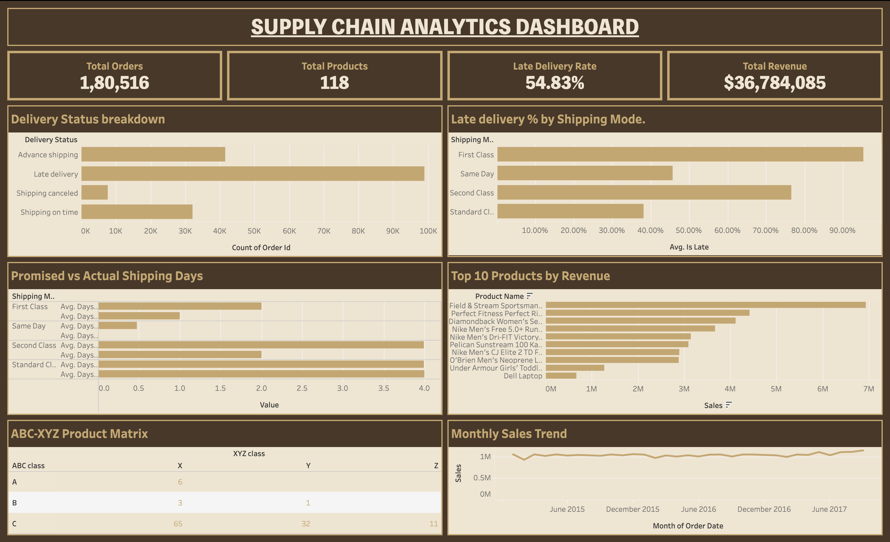

# Supply Chain Analytics Dashboard

An end-to-end supply chain analytics project analyzing 180K+ retail orders to identify which products deserve the most inventory attention, forecast demand for top revenue drivers, uncover the real root cause of delivery delays, and rank products by operational risk.

[**[Live Interactive Dashboard (Tableau Public)](#)** ← add your Tableau Public link here once published
](https://public.tableau.com/app/profile/jiya.jiya2812/viz/SupplyChainAnalyticsDashboard_17867997297090/Dashboard1?publish=yes)



## Business Problem

A retail company is seeing over half of its orders delivered late and wants to know: which products actually matter most to the business, why deliveries are late, how reliably demand can be forecast, and which products carry the most operational risk going forward.

## Dataset

[DataCo Smart Supply Chain Dataset](https://www.kaggle.com/datasets/shashwatwork/dataco-smart-supply-chain-for-big-data-analysis) (Kaggle) — 180,519 orders, January 2015–January 2018, spanning 164 countries and 118 products.

## Methodology

**1. Data Cleaning (Python / Pandas)**
Removed personally identifiable columns (customer email, password, name, street), dropped fully-empty and low-value fields, converted date columns to proper datetime format, and validated the data for duplicates and negative/erroneous values (none found).

**2. ABC-XYZ Inventory Analysis**
Classified all 118 products by revenue contribution (ABC) crossed with demand volatility (XYZ, measured via coefficient of variation). Found that just 6 products (5% of the catalog) drive 70% of total revenue, and all 6 fall into the most stable, predictable demand category — meaning the business's top earners are not an operational risk.

**3. Demand Forecasting**
Built and compared two forecasting approaches — a moving-average baseline and exponential smoothing (with an optimized smoothing parameter) — for the top 6 revenue products, validated with a proper train/test split. In the process, identified a data completeness issue: total order volume across the entire business dropped roughly 80% starting October 2017, which was inflating forecast error into the hundreds of percent. After excluding the incomplete period, the optimized model achieved 2.7–5.3% forecast error across all 6 products, roughly a 46% improvement over the naive baseline.

**4. Root-Cause Analysis (Logistic Regression)**
Tested shipping mode, order region, market, discount rate, order quantity, and sales amount as potential predictors of late delivery. Region, market, discount, quantity, and sales showed no meaningful relationship (correlations near zero). Shipping mode, however, showed a strong and statistically confirmed effect: First Class orders are promised 1-day delivery but average 2 days in practice, resulting in a 95% late-delivery rate — more than double Standard Class (38%), which promises a realistic 4-day window and consistently meets it. The regression model reached 69.5% prediction accuracy, well above the 55% baseline rate of simply guessing "late" every time.

**5. Risk Scorecard**
Combined each product's ABC class, XYZ class, and (where available) forecast error into a composite 0–9 risk score, with a flag distinguishing scores backed by real forecast validation from baseline-only estimates.

**6. Interactive Dashboard (Tableau)**
Brought everything together into a single dashboard: KPI summary cards, delivery status and shipping-mode performance breakdowns, the promised-vs-actual shipping day comparison, the ABC-XYZ product matrix, top revenue products, the monthly sales trend, and the risk scorecard.

## Key Findings

- **55% of all orders are late** — but the cause isn't logistics, geography, order size, or discounting. It's a shipping-mode promise mismatch: First Class is marketed as 1-day delivery but actually takes 2 days on average.
- **Just 10 of 118 products (8%) generate 90% of total revenue** — a clear signal for where inventory and operational attention should concentrate.
- Demand forecasting for top products is highly accurate (2.7–5.3% error) once a real data completeness issue was caught and corrected — a step that materially changed the conclusions.
- 11 products are both low-revenue and highly unpredictable (CZ classification), making them strong candidates for reduced inventory investment.

## Tools

Python (Pandas, scikit-learn, statsmodels), Tableau Public.

## Repository Structure

```
clean_data.py                    # Data cleaning
abc_xyz_analysis.py              # ABC-XYZ product classification
forecasting.py                   # Demand forecasting + model comparison
root_cause_analysis.py           # Logistic regression on delivery delays
risk_scorecard.py                # Composite risk scoring
abc_xyz_classification.csv       # ABC-XYZ output
forecast_results.csv             # Forecast accuracy by product
shipping_mode_risk_factors.csv   # Regression coefficients
late_rate_by_shipping_mode.csv   # Late % by shipping mode
final_risk_scorecard.csv         # Final combined risk scores
dashboard_screenshot.png         # Dashboard preview image
README.md
```

## Author

Jiya — [LinkedIn](#) · [GitHub](https://github.com/jiyagithub)
